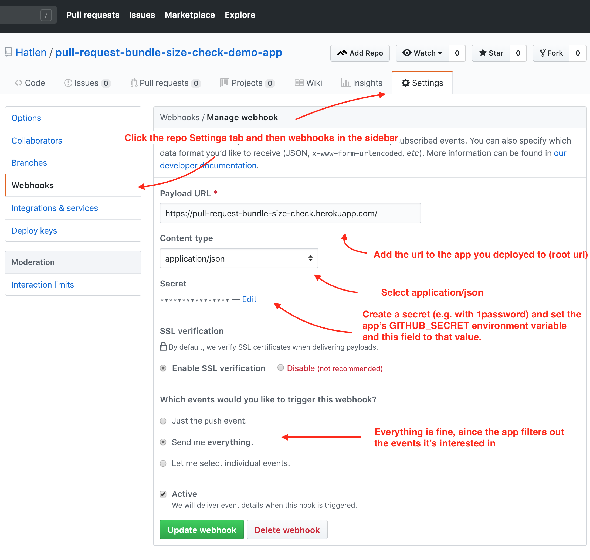

# Description

A service for adding a custom check to github pull requests that checks how much
the your webpack bundles size/sizes have increased or decreased. You can set a
max size increase limit (by default 4KB) and if your bundles' size increases
more than that you'll get a red status/check on your pull request. The check
links to a bundle file size changes report so that you can see which
bundle/entry caused the increase and there's link to webpack-bundle-analyzer
tree map reports for both the master branch and your feature branch in the
report so that you can analyze deeper.
Feel free to extend this service to also e.g. run accessibility linting, run
smoke tests against the pull requests review app etc.

## How to use

To be able to use this repo without modifying the code you have to use github,
and amazon s3.
I'm planning to package the report generating logic into an npm package so that
you can use your own preferred services for git hosting and static asset saving,
but that's for laters.

### Setup amazon S3 (used for persistent storing)

Creating AWS users with accesses to a specific S3 bucket can be quite
intimidating the first times, the UI for creating buckets and users contains
so many options and you need to figure out which that's needed, just an
upfront warning if you aren't an avid AWS user :).

- Create an S3 bucket
- Create a programmatic access IAM user with rights to upload to that bucket
- Configure the following environment variables on your app to the appropriate
  values: `AWS_ACCESS_KEY_ID`, `AWS_SECRET_ACCESS_KEY`, `AWS_S3_BUCKET_NAME` and
  `AWS_S3_REGION` (go to e.g. this page
  https://docs.aws.amazon.com/general/latest/gr/rande.html to figure out which
  region "code" to use. E.g. the code for `EU (frankfurt)` is `eu-central-1`.
  I always try to find that code on the bucket settings pages but haven't found
  it yet on those pages :) which I found super weird.)

### Deploy the app

I'm using heroku for hosting. To get that to work you create a new heroku app
and push this repository to it (or configure it to auto-deploy whenever you push
code to github).

### Create a github personal access token (for setting statuses on the pull requests)

See
https://help.github.com/articles/creating-a-personal-access-token-for-the-command-line/
for instructions on how to create, then set your apps'
GITHUB_PERSONAL_ACCESS_TOKEN environment to that token.

### Configure your github repo/repos to send webhook events to your app/service

For every repo you want to test you add a webhook on the settings page that
calls your app.

- Set the payload url to your apps root url.
- Set the content encoding to application/json
- Set the secret to some secret random string
- Set your apps' GITHUB_SECRET environment variable to the same random string
- Select to send all events to the webhook (Send me everything)



### Create a yarn script that builds the app with the webpack-bundle-analyzer plugin

Add a yarn script that builds the app with the
webpack-bundle-analyzer plugin to the app/repo that you are going to add the
bundle size check to. The default script that is run is
`webpack-bundle-analyzer`, it's possible to override by setting the
`BUILD_AND_ANALYZE_SCRIPT` environment variable). Configure the plugin to use
the static "analyzerMode" and output a webpack stats file:

```javascript
// webpack configuration file/object/json (e.g. webpack.config.js)
module.exports = {
  // all your normal config
  plugins: [
    new require("webpack-bundle-analyzer").BundleAnalyzerPlugin({
      analyzerMode: "static",
      generateStatsFile: true
    })
  ]
};
```
