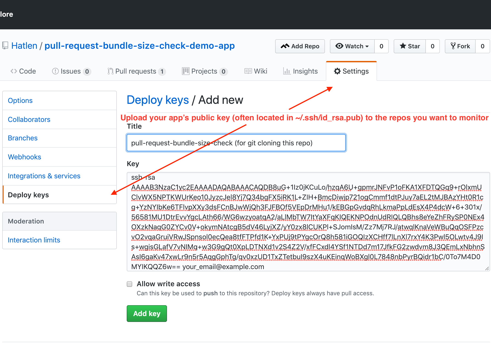

# Pull request bundle size check

## Background / motivation

Webpack bundles has a tendency to grow over time if you don't carefully
monitor how every code addition you create affects the size of your bundles.
By making it easy for code reviewers and code writers to spot pull requests that
unintentionally create unnecessarily big bundle size increases, you can
(more easily) keep your bundle sizes small and performant.

## Description

This is a service/app that adds a custom check to github pull requests, that
checks how much your webpack bundles' size/sizes have increased or decreased.
If your pull request increased the size by more than the max increase limit (by
default 2kB) the service sets a failed status on your pull request.
The status links to a report of how the bundles' sizes was changed by the pull
request. The report also has links to a detailed treemap of how the size is
distributed between your different npm modules, folders and files (a
[webpack-bundle-analyzer](https://github.com/webpack-contrib/webpack-bundle-analyzer)
report). You also get a treemap for the master branch so that you easily can
compare your pull request with the current master branch's state. You also get
webpack [stats.json](https://webpack.js.org/api/stats/) files for your branch
and the master branch if you want to dig deep into the reasons why the size
increased.

You can see some examples of what it looks like in this
[demo
repository](https://github.com/hatlen/pull-request-bundle-size-check-demo-app).
[Here's a pull
request](https://github.com/Hatlen/pull-request-bundle-size-check-demo-app/pull/2)
that increased the level to much. And here's a direct link to the generated
[report](http://s3-eu-central-1.amazonaws.com/pull-request-bundle-size-check/pull-request-bundle-size-check-demo-app-accidentally-add-all-of-lodash-index.html)

## How to use

To be able to use this repo without modifying the code you have to use github,
and amazon s3.
I'm planning to package the report generating logic into an npm package so that
you can use your own preferred services for git hosting and static asset saving,
but that's for laters.

### Setup amazon S3 (used for persistent storing)

Since heroku doesn't have a persistent file system you needs to persist the
generated reports some other place and in this project I choose s3.
Creating AWS users with accesses to a specific S3 bucket can be quite
intimidating the first times you do it, the UI for creating buckets and users
contains so many options and you need to figure out which are needed, just
an upfront warning if you are new to s3 :).

- Create a S3 bucket (and make sure to set all public access settings to
  false. Not doing that bit me hard when I set up my last bucket. I clicked
  create in the first bucket creation step and that turned on all 4 public
  access settings (on the permissions tab) and with those turned on it's not
  possible to set objects'/files' access control levels to public-read even
  though your user's policy allows it)
- Create a programmatic access IAM user with the rights to upload to your new
  bucket. I used an "Inline policy" like this (where
  pull-request-bundle-size-check is the bucket name):
  ```json
  {
    "Version": "2012-10-17",
    "Statement": [
      {
        "Sid": "VisualEditor0",
        "Effect": "Allow",
        "Action": "s3:*",
        "Resource": [
          "arn:aws:s3:::pull-request-bundle-size-check",
          "arn:aws:s3:::pull-request-bundle-size-check/*"
        ]
      }
    ]
  }
  ```
- Configure the following environment variables on your app to use your newly
  created bucket and IAM user: `AWS_ACCESS_KEY_ID`, `AWS_SECRET_ACCESS_KEY`,
  `AWS_S3_BUCKET_NAME` and `AWS_S3_REGION` (go to e.g. this page
  https://docs.aws.amazon.com/general/latest/gr/rande.html to figure out which
  region "code" to use. E.g. the code for `EU (frankfurt)` is `eu-central-1`.
  I always try to find that code on the bucket settings pages but haven't found
  it yet on those pages :) which I found super weird.)

### Deploy the app

I'm using heroku for hosting. If you want to deploy this repo to heroku you can
click this button:

[](https://heroku.com/deploy)

If you want to modify this repo you should fork this repo and then click the
button in your fork's README.md.

### Upload the app's public ssh key to the github repo/repos you want to monitor

If your hosting provider creates a persistent ssh key for your app, you just
upload the public key to the repositories you want to monitor.


Heroku doesn't persist the ssh key over deploys unfortunately. If you deploy
with the button above you get an extra
[buildpack](https://devcenter.heroku.com/articles/buildpacks)
(https://github.com/debitoor/ssh-private-key-buildpack) that uses
an environment variable as the app's ssh key. Create an ssh key, base64 encode
it and set your apps SSH_KEY environment variable to that value:

- [Generate an ssh key](https://help.github.com/enterprise/2.15/user/articles/generating-a-new-ssh-key-and-adding-it-to-the-ssh-agent/)
  ```shell
  ssh-keygen -t rsa -b 4096 -C <your email address>
  ```
- [Set your apps SSH_KEY environment variable to that key](https://github.com/debitoor/ssh-private-key-buildpack#configure-ssh-key)
  ```shell
  heroku config:set SSH_KEY=$(cat <path to your newly generated ssh key> | base64)
  ```

### Create a github personal access token (for setting statuses on the pull requests)

See
https://help.github.com/articles/creating-a-personal-access-token-for-the-command-line/
for instructions on how to create it, then set your apps'
GITHUB_PERSONAL_ACCESS_TOKEN environment to that token.

### Configure your github repo/repos to send webhook events to your app/service

For every repo you want to monitor you add a webhook tha sends events to
your service/app.

- Set the payload url to your apps root url.
- Set the content encoding to application/json
- Set the secret to some secret random string
- Set your apps' GITHUB_SECRET environment variable to the same random string
- Select to send all events to the webhook (Send me everything)


### Create a yarn script that builds the app with the webpack-bundle-analyzer plugin

In the repos you are going to monitor you need to add a yarn script that builds
the app with the webpack-bundle-analyzer plugin. The default name for the script
that is run is `webpack-bundle-analyzer`, it's possible to override by setting
the `BUILD_AND_ANALYZE_SCRIPT` environment variable). Configure the plugin to
use the static "analyzerMode" and output a webpack stats file:

```javascript
// webpack configuration file/object/json (e.g. webpack.config.js)
module.exports = {
  // all your normal config
  plugins: [
    new require("webpack-bundle-analyzer").BundleAnalyzerPlugin({
      analyzerMode: "static",
      generateStatsFile: true
    })
  ]
};
```

## Troubleshooting

To see your deployed service's logs set the `DEBUG` environment variable to `*`
or `error,log` if you don't want to see lots (!) of babel debug output.
If you think you've fixed an issue you can trigger a rebuild by going to the
webhook settings page and edit the webhook, then at the bottom of the page you
can inspect and redeliver recent events. It can be quite tricky to find the
event that you are interested in, especially if you have lots of integrations on
github, but look for the latest pull_request create or synchronize event.
